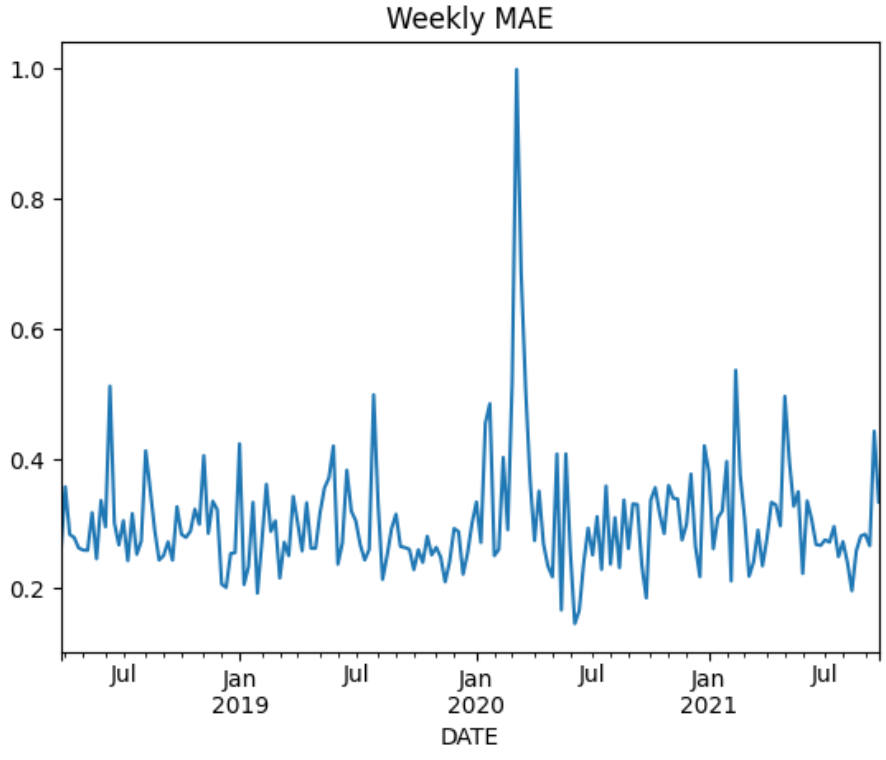
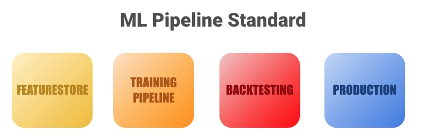

# MCP (Model Construction Planner)

## Time-oriented ML design
A correct machine learning formulation for financial time series problems requires careful handling of out-of-sample data. This is critical for both model selection and the correct interpretation of performance.

Any maintainable solution for training and evaluating machine learning models in this context must, at its core, support the proper splitting of training, validation, and testing sets such that:

* Observations are ordered in time: training data precedes validation data, which in turn precedes test data.
* Overlapping forward returns are addressed by introducing appropriate gaps when using holdout sets for evaluation.

Failure to respect time ordering can introduce unnecessary biases and lead to misleading results. For example, if a dataset is randomly shuffled before being split into training and test sets, observations from the future may end up in the training set while earlier observations are used for testing. This setup does not reflect how time series problems are encountered in real-world financial settings. Financial contexts are inherently path-dependent, relying on information available up to a given point in time. As a result, such data leakage can artificially inflate model performance by incorporating information that would not have been available under normal operating conditions.

### Evaluation and model selection considerations
If targets, $Y$, within a dataset are expressed as forward returns that overlap in time, one can erroneously count periods that contributed to the calculation of returns more than once. This can misleadingly inflate performance if adjacent observations consider overlapping returns to calculate a loss for the function to be optimized.

Consider the next image, where three observations, denoted by $x_{i}$, have as its target a value, or return, that spans across four time steps in the future. Using this data "as is" for performance evaluation would be similar to tripling a student's grades for answering three question even though these were part of one single exam.
<p align="center">

</p>
In the context of model selection or hyperparameter tuning, a type of "confounding factor" can be introduced if we evaluate model variants with this type of targets. Is the best performing model truly the best or is it fitting to highly correlated signals? Is the learning rate correctly set or Maduro's capture influenced the markets?


### Gaps introduction as a fix
Each evaluation observation should correspond to exactly one realized future outcome. This is ensured by selecting evaluation records whose target windows do not overlap.
If the prediction horizon spans four time steps, then during evaluation only, records must be chosen such that their target windows are at least four time steps apart.

<p align="center">

</p>

### How can we put this into practice?

This proposal is based on leveraging reusable custom Python classes for training and evaluating supervised machine learning models, where time-ordered data folds serve as the primary guiding principle. Reusability and parametrization are what make it possible to plan model construction through simple configuration schemes.

Under this approach, five custom classes (or logical components) can be configured and instantiated using concise syntax defined in a YAML file.

<p align="center">

</p>


### Core components

#### `TaskHandler`
Central orchestration layer. It loads and parses the YAML configuration file and wires together dataset handling, time-based folds, cross-validation, hyperparameter optimization, and model training workflows.

#### `ModelTrainer`
Encapsulates the model training and evaluation logic over time-ordered splits. For each fold, it:

- Builds training and validation datasets based on time boundaries  
- Selects and prepares feature and target matrices  
- Fits the model instance provided by `ModelObject`  
- Generates predictions on the validation set  
- Computes evaluation metrics across folds  

#### `TimeFolder`
Generates a sequence of rolling, time-ordered training and validation intervals. It supports configurable training windows, validation windows, and optional gaps to prevent target overlap in forward-looking evaluations.

#### `ModelObject`
Factory and wrapper for machine learning models. It instantiates a model based on the selected algorithm, problem type (regression, binary, or multiclass classification), and hyperparameters, and exposes a uniform `fit` and `predict` interface.

Now that an appropriate approach for handling financial time-series data in machine learning has been outlined, a stacked model composed of a primary model and a secondary model is introduced. The outputs of the primary model are used as inputs, or features, for the secondary model.

## Primary model
### Probabilities as "Sentiment Scores"
Multiclass probability outputs from group-specific models act as soft, distribution-aware sentiment signals that encode group-level expectations and uncertainty, and can be used as informative features by a higher-level model.


For a multiclass classification problem with \(K\) classes, the softmax function maps the raw model outputs (logits) $z_i$ into class probabilities:

$$
p_i = \frac{e^{z_i}}{\sum_{j=1}^{K} e^{z_j}}
$$

The associated cost function, commonly referred to as **categorical cross-entropy**, is defined as:

$$
\mathcal{L} = - \sum_{i=1}^{K} y_i \log(p_i)
$$

where $y_i$ is the true class indicator and $p_i$ is the predicted probability for class \(i\).

#### Interpretation as sentiment scores

The softmax output represents a probability distribution over classes, with all class probabilities summing to one. In the context of bearish, neutral, and bullish classes, these probabilities can be interpreted as **sentiment scores**, reflecting both the predicted class and the model’s confidence.

Rather than assigning a single discrete label, the model provides a graded view of expected outcomes, capturing uncertainty and relative strength across market states.


#### Target variable transformation
The target variable is defined as normalized (z-scored) forward returns and is originally a continuous value. For classification problems, this continuous target is transformed into discrete classes based on its position in the normalized return distribution.

This transformation is implemented by the `norm_to_classes` method of the `Dataset` class. Given two z-score thresholds, `a` and `b`, each normalized return is assigned to one of three classes:

- Returns with z-scores lower than `a` are labeled as class `0`  
- Returns with z-scores between `a` and `b` are labeled as class `1`  
- Returns with z-scores higher than `b` are labeled as class `2`  

In the current setup, the thresholds are set to `a = -0.43` and `b = 0.043`. This procedure divides the normalized return distribution into three regions (lower, central, and upper), allowing a continuous target to be used in a classification setting while still retaining information about the extent to which each observation is extreme.

#### Data leakage considerations

No data leakage is introduced in this setup because sentiment scores are always generated using information strictly before the prediction period. For each step, a fixed number of preceding periods, denoted as $N$, is used to train the sentiment model, and predictions are produced only for the subsequent period, $N+1$.

Importantly, only the predictions obtained on these holdout periods (single-period observations) are retained. These out-of-sample predictions are then joined back to the original dataset, aligned with their corresponding timestamps.

As a result, when the secondary model is trained, it only has access to sentiment scores that were computed using past data relative to each observation. The secondary model therefore starts at period $N+1$, ensuring that every feature used at time $t$ is derived exclusively from information available up to time $t-1$.

#### Setup
In an Unix like environment:
```python
python3 -m venv MCP
source MCP/bin/activate
pip3 install -r requirements.txt
```

#### Training
```python
import warnings
from MCP import Dataset, TaskHandler

dataset = Dataset.get()
commodities_datasets = {k:dataset[dataset.TRADE_12 == k] for k in dataset.TRADE_12.unique()}
commodity_list = list(commodities_datasets.keys())

arr = list()
start = '2010-01-05'
end = '2021-09-28'

for commodity, df_commodity in commodities_datasets.items():
    print(commodity)
    kpis_df = TaskHandler('sentiment_scores').simple_retrain(df_commodity, start, end)
    arr.append(kpis_df)

names = ('DATE', 'TRADE_ID', 'BEARISH_SCORE', 'NEUTRAL_SCORE', 'BULLISH_SCORE')
sentiment_scores = pd.concat(arr).rename(columns={i:d for i,d in enumerate(names)})
sentiment_scores.to_parquet('sentiment_scores.parquet', index=False)
```
 We can see from the last code snippet that for each unique value of the column `TRADE_12` (commodity groups):

```bash
Precious Metals
Oilseeds
Softs
Grains
Metals
Energy
Livestock
Gas
Dairy
Emissions
Industrial Material
Coal
Fertilizers
```
 
 Each model is fitted across the period specified by the variables `start` and `end`. Within the method `simple_retrain`, sentiment scores are generated according to this configuration (contained in the `sentiment_scores.yaml` file):

 ```yaml
retrain_info:
    period_type: weeks
    train_size: 52
    test_size: 1
```

What that means is that for each week, within the specified period, we will use the preceding 52 weeks to generate scores. The scored hold-out periods will then be used as new features that need to be joined to the original dataset.


```python
import pandas as pd

join_cols = ['DATE', 'TRADE_ID']
sentiment_scores = pd.read_parquet('sentiment_scores.parquet')

enhanced_dataset = pd.merge(dataset.reset_index(),
                            sentiment_scores,
                            how='left',
                            left_on=join_cols,
                            right_on=join_cols).fillna(-1)

enhanced_dataset = enhanced_dataset[enhanced_dataset['DATE'] >= sentiment_scores['DATE'].min()]
```

## Secondary Model

#### Cross Validation Through Time Arrangement
Once the sentiment scores have been generated and we have a unified, or enhanced, dataset, we can proceed with the secondary model, which will leverage the generated probabilities obtained after fitting a model for each commodity group contained in the original dataset. To clarify how we can use the MCP framework to perform hyperparameter tuning, we should first use the `TimeFolder` class to calculate the training and validation set sizes in our configuration plan.

```python
from MCP import TimeFolder

start_date = '2010-01-05'
end_date = '2021-09-28'
cv_folds = 5
train_size, test_size = TimeFolder.sizes_calculator(start_date,
                                                    end_date,
                                                    cv_folds=cv_folds,
                                                    space_to_fill=0.5,    # <-- This is the fraction of the period to be used for testing/validation
                                                    period_type='weeks', #     in the moving window. In other words, 50% of the periods will be used
                                                    periods=1)           #     to construct 5 folds that will be used to validate/evaluate a model.
```
The class method `sizes_calculator` returns a tuple that can be fed into the class again to get the folds:
```python
TimeFolder(train_size,
           test_size,
           period_type='weeks').get_time_splits(start_date, end_date)

```
The previous command would output the following:
```python
[[datetime.datetime(2010, 1, 5, 0, 0),    # train start |      intervals are:
  datetime.datetime(2015, 11, 24, 0, 0),  # test start  | -->  [train start, test start) &
  datetime.datetime(2017, 1, 24, 0, 0)],  # test end    |      [test start, test end]
 [datetime.datetime(2011, 3, 8, 0, 0),
  datetime.datetime(2017, 1, 24, 0, 0),
  datetime.datetime(2018, 3, 27, 0, 0)],
 [datetime.datetime(2012, 5, 8, 0, 0),
  datetime.datetime(2018, 3, 27, 0, 0),
  datetime.datetime(2019, 5, 28, 0, 0)],
 [datetime.datetime(2013, 7, 9, 0, 0),
  datetime.datetime(2019, 5, 28, 0, 0),
  datetime.datetime(2020, 7, 28, 0, 0)],
 [datetime.datetime(2014, 9, 9, 0, 0),
  datetime.datetime(2020, 7, 28, 0, 0),
  datetime.datetime(2021, 9, 28, 0, 0)]]
```
This functionality is already incorporated within `TaskHandler`. 

#### Training
A regression model will be configured to predict the target `TARGET_VOL_NORM_RETURN_OIM_5D`, which are the normalized returns of the following 5 days.
(See `models/PoC.yaml` for the details on how to configure cross-validation.)

```python
from MCP import TaskHandler

train_start = enhanced_dataset['DATE'].min().strftime('%Y-%m-%d')
train_end = '2018-03-27'
test_end = '2021-09-28'

model, df_test = TaskHandler('PoC').train_with_best_params(enhanced_dataset, train_start, train_end, test_end)
```
The method `train_with_best_params` performs the following:
1. Splits the dataset into a training and a hold-out dataset.
2. Performs time-aware cross-validation over the training set using a moving window in order to identify the best hyperparameter configuration.
3. Retrains the model on the full training set using the selected hyperparameters.

#### Evaluation
Model performance is evaluated using the Mean Absolute Error (MAE):

$$
\text{MAE} = \frac{1}{n} \sum_{i=1}^{n} |y_i - \hat{y}_i|
$$

This metric is chosen for its interpretability. Unlike the mean squared error, MAE is expressed in the same units as the target variable. Since the target is defined in terms of z-scores, the resulting MAE directly quantifies the average deviation of the model’s predictions from the observed values.

```python
from sklearn.metrics import mean_absolute_error

def group_mae(df):
    y_true = df['y_true'].values
    y_pred = df['y_pred'].values
    return mean_absolute_error(y_true, y_pred)

df_test.groupby('DATE').apply(group_mae).plot(title='Monthly MAE')
```
<p align="center">

</p>
Visualizing performance across time is useful for:
1. Assessing the stability of model performance.
2. Identifying potential regime shifts or trends that may indicate performance degradation.
  * If degradation is observed, some of the utilities provided by the MCP framework (such as `retrain`) can support the assessment of how frequently models should be retrained in order to maintain consistent predictive quality.

## Final remarks
The purpose of this material is to illustrate how a reusable, and therefore maintainable, machine learning framework can be designed to promote scalability and iterative experimentation. Rather than focusing exclusively on identifying a single best-performing model, the motivation behind this design is to enable flexibility across a wide range of problems.

This includes support for multiple algorithms, different types of prediction tasks (regression or classification), and the ability to stack models by planning their construction through configuration files. The overarching goal is to allow ideas to be tested quickly and systematically, prioritizing experimentation and clear reasoning within organizations that depend on machine learning for decision-making.

### Live deployment considerations
Reliable machine learning in production rests on four foundational pillars that together define an organization’s ML standard. While this document focuses primarily on model training pipelines, sustainable ML-driven impact requires careful consideration of the following components.
<p align="center">

</p>

* __1) Featurestore__: The backbone of any production-grade machine learning system is the ability to generate and maintain predictive features. Featurestores must reliably ingest raw data, apply transformations, and expose features at a frequency aligned with the organization’s decision-making needs.

* __2) Supervised Training Pipelines__: When featurestores are properly maintained, training models and generating predictions using frameworks such as the one presented here should become a routine operation. Outputs from both production and experimental models should be stored (either in the feature store or in a data warehouse) to enable systematic comparison and continuous improvement.

* __3) Backtesting__: Predictions produced by supervised models often inform business rules and strategic decisions. As a result, it is essential to have mechanisms in place to simulate counterfactual or “what-if” scenarios in order to evaluate the real-world impact of ML-driven decisions. Machine learning is a means to an end, not the end itself.

* __4) Production__: The previous three stages must be satisfied, in sequence, before deploying models into a decision-making environment. All components evaluated during training, validation, and backtesting must be reproducible in production. This requires strict parity between training and production data pipelines, careful handling of data leakage, and robust processes for governance, quality assurance, monitoring, and organizational alignment.
