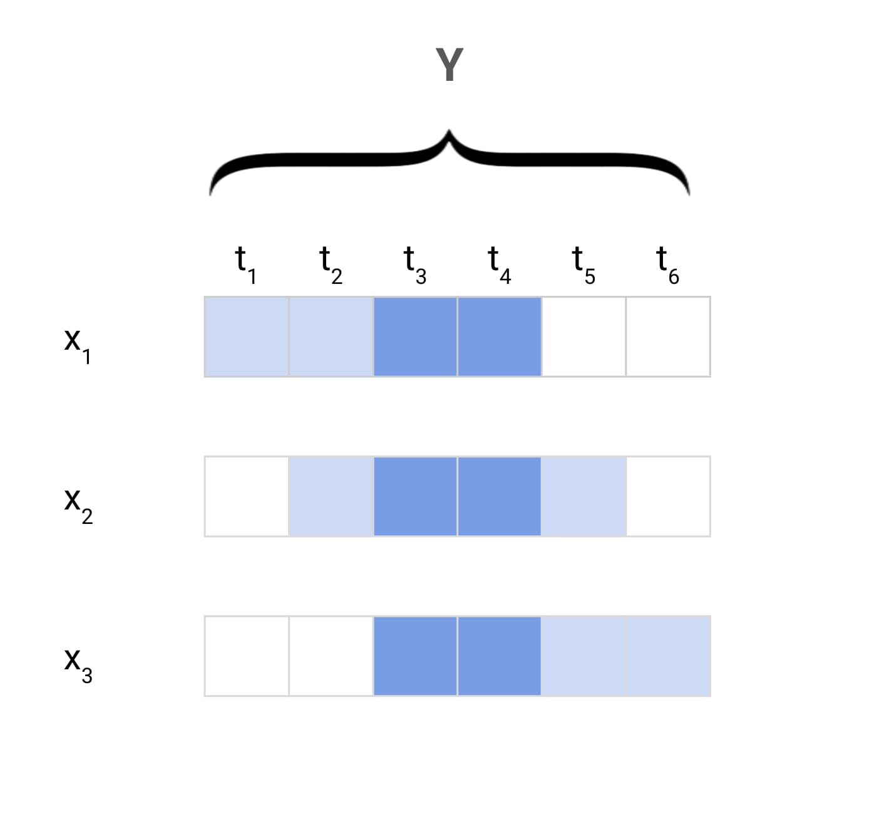
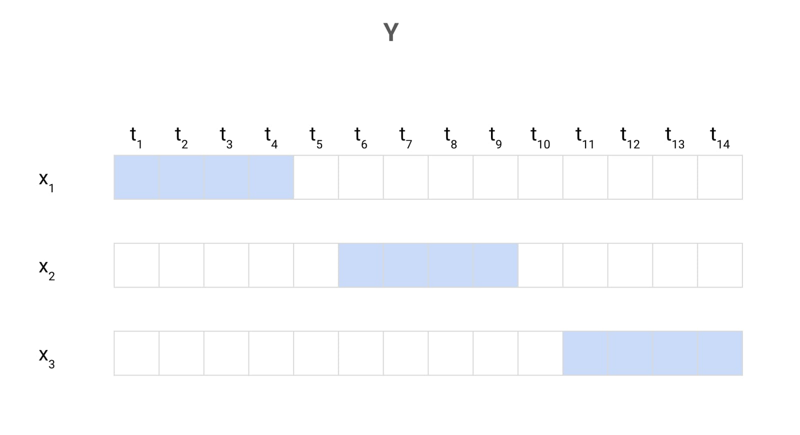

# MCP
#### Model Construction Planner

Correct Machine Learning formuation for financial time series problems requires careful handling of out-of-sample data. This is pivotal for both model selection and interpreting performance.

Any mantainable solution focused on training and evaluating ML models of the aforementioned nature needs to consider at its core the capability of splitting training, validation, and testing sets such that:
* Observations are ordered in time, that is, training observations precede validation, and validation precedes testing.
* Overlapping forward returns are corrected by introducing gaps when using hold out sets for evaluation.

<p align="center">

</p>
<p align="center">

</p>

Usage
```python
import warnings
from MCP import Dataset, TaskHandler
warnings.filterwarnings("ignore")


train_start = '2010-01-05'
train_end = '2018-03-27'
test_end = '2021-09-28'

dataset = Dataset.get()
th = TaskHandler('PoC').train_with_best_params(dataset, train_start, train_end, test_end)
```

### Sentiment Scores
```python
commodities_datasets = {k:dataset[dataset.TRADE_12 == k] for k in dataset.TRADE_12.unique()}
commodity_list = list(commodities_datasets.keys())

arr = list()
start = '2010-01-05'
end = '2011-04-12'

for i in range(len(commodity_list)):
    print(commodity_list[i])
    kpis_df = TaskHandler('sentiment_scores').simple_retrain(dataset, start, end)
    arr.append(kpis_df)

pd.concat(arr).to_csv('sentiment_scores_v0.csv', index=False)
```


#### To do:
Introduce gaps in train and test fold sizes.
```python
from datetime import datetime
from dateutil.relativedelta import relativedelta

from MCP import TimeFolder


fmt = '%Y-%m-%d'
dates = list()
date = datetime.strptime(start_date, fmt)
space_to_fill = 0.5
cv_folds = 5

while date <= datetime.strptime(end_date, fmt):
    dates.append(date)
    date += relativedelta(weeks=1)

space_to_fill_index = int(space_to_fill*len(dates))
test_size = int(len(dates[:space_to_fill_index]) / cv_folds)
train_size = len(dates[space_to_fill_index:])

print(train_size, test_size)

time_folder = TimeFolder(train_size=train_size, test_size=test_size, period_type='weeks')
folds = time_folder.get_time_splits(start_date, end_date)

assert cv_folds == len(folds)
```
