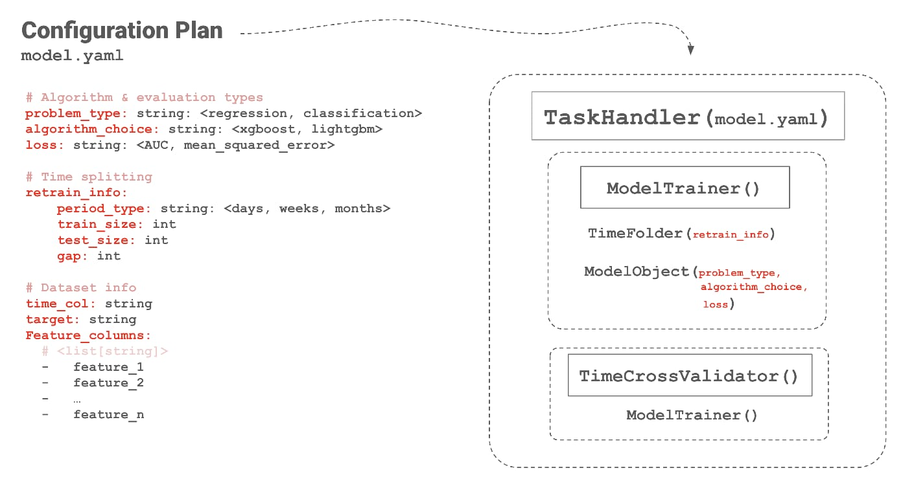

# MCP (Model Construction Planner)

## Time-oriented ML design
A correct machine learning formulation for financial time series problems requires careful handling of out-of-sample data. This is critical for both model selection and the correct interpretation of performance.

Any maintainable solution for training and evaluating machine learning models in this context must, at its core, support the proper splitting of training, validation, and testing sets such that:

* Observations are ordered in time: training data precedes validation data, which in turn precedes test data.
* Overlapping forward returns are addressed by introducing appropriate gaps when using holdout sets for evaluation.

Failure to respect time ordering can introduce unnecessary biases and lead to misleading results. For example, if a dataset is randomly shuffled before being split into training and test sets, observations from the future may end up in the training set while earlier observations are used for testing. This setup does not reflect how time series problems are encountered in real-world financial settings. Financial contexts are inherently path-dependent, relying on information available up to a given point in time. As a result, such data leakage can artificially inflate model performance by incorporating information that would not have been available under normal operating conditions.

### Evaluation and model selection considerations
If targets, $Y$, within a a dataset are expressed as forward returns that overlap in time, one can erroneously count periods that contributed to the calculation of returns more than once. This can misleadingly inflate performance if adjacent observations consider overlapping returns to calculate a loss for the function to be optimized.

Consider the next image, where three observations, denoted by $x_{i}$, have as its target a value, or return, that spans across four time steps in the future. Using this data "as is" for performance evaluation would be similar to tripling a student's grades for answering three question even though these were part of one single exam.
<p align="center">

</p>
In the context of model selection or hyperparameter tuning, a type of "confounding factor" can be introduced if we evaluate model variants with this type of targets. Is the best performing model truly the best or is it fitting to highly correlated signals? Is the learning rate correctly set or Maduro's capture influenced the markets?


### Gaps introduction as a fix
Each evaluation observation should correspond to exactly one realized future outcome. This is ensured by selecting evaluation records whose target windows do not overlap.
If the prediction horizon spans four time steps, then during evaluation only, records must be chosen such that their target windows are at least four time steps apart.

<p align="center">

</p>

### How can we put this into practice?

This proposal is based on leveraging reusable custom Python classes for training and evaluating supervised machine learning models, where time-ordered data folds serve as the primary guiding principle. Reusability and parametrization are what make it possible to plan model construction through simple configuration schemes.

Under this approach, five custom classes (or logical components) can be configured and instantiated using concise syntax defined in a YAML file.

<p align="center">

</p>


### Core components

#### `TaskHandler`
Central orchestration layer. It loads and parses the YAML configuration file and wires together dataset handling, time-based folds, cross-validation, hyperparameter optimization, and model training workflows.

#### `ModelTrainer`
Encapsulates the model training and evaluation logic over time-ordered splits. For each fold, it:

- Builds training and validation datasets based on time boundaries  
- Selects and prepares feature and target matrices  
- Fits the model instance provided by `ModelObject`  
- Generates predictions on the validation set  
- Computes evaluation metrics across folds  

#### `TimeFolder`
Generates a sequence of rolling, time-ordered training and validation intervals. It supports configurable training windows, validation windows, and optional gaps to prevent target overlap in forward-looking evaluations.

#### `ModelObject`
Factory and wrapper for machine learning models. It instantiates a model based on the selected algorithm, problem type (regression, binary, or multiclass classification), and hyperparameters, and exposes a uniform `fit` and `predict` interface.

Now that an appropriate approach for handling financial time-series data in machine learning has been outlined, a stacked model composed of a primary model and a secondary model is introduced. The outputs of the primary model are used as inputs, or features, for the secondary model.

## Primary model
### Probabilities as "Sentiment Scores"
Multiclass probability outputs from group-specific models act as soft, distribution-aware sentiment signals that encode group-level expectations and uncertainty, and can be used as informative features by a higher-level model.


For a multiclass classification problem with \(K\) classes, the softmax function maps the raw model outputs (logits) $z_i$ into class probabilities:

$$
p_i = \frac{e^{z_i}}{\sum_{j=1}^{K} e^{z_j}}
$$

The associated cost function, commonly referred to as **categorical cross-entropy**, is defined as:

$$
\mathcal{L} = - \sum_{i=1}^{K} y_i \log(p_i)
$$

where $y_i$ is the true class indicator and $p_i$ is the predicted probability for class \(i\).

#### Interpretation as sentiment scores

The softmax output represents a probability distribution over classes, with all class probabilities summing to one. In the context of bearish, neutral, and bullish classes, these probabilities can be interpreted as **sentiment scores**, reflecting both the predicted class and the model’s confidence.

Rather than assigning a single discrete label, the model provides a graded view of expected outcomes, capturing uncertainty and relative strength across market states.


#### Target variable transformation
The target variable is defined as normalized (z-scored) forward returns and is originally a continuous value. For classification problems, this continuous target is transformed into discrete classes based on its position in the normalized return distribution.

This transformation is implemented by the `norm_to_classes` method of the `Dataset` class. Given two z-score thresholds, `a` and `b`, each normalized return is assigned to one of three classes:

- Returns with z-scores lower than `a` are labeled as class `0`  
- Returns with z-scores between `a` and `b` are labeled as class `1`  
- Returns with z-scores higher than `b` are labeled as class `2`  

In the current setup, the thresholds are set to `a = -0.43` and `b = 0.043`. This procedure divides the normalized return distribution into three regions (lower, central, and upper) allowing a continuous target to be used in a classification setting while still keeping information about how extreme each observation is.

#### Data leakage considerations

No data leakage is introduced in this setup because sentiment scores are always generated using information strictly prior to the prediction period. For each step, a fixed number of preceding periods, denoted as $N$, is used to train the sentiment model, and predictions are produced only for the subsequent period, $N+1$.

Importantly, only the predictions obtained on these holdout periods (single-period observations) are retained. These out-of-sample predictions are then joined back to the original dataset, aligned with their corresponding timestamps.

As a result, when the secondary model is trained, it only has access to sentiment scores that were computed using past data relative to each observation. The secondary model therefore starts at period $N+1$, ensuring that every feature used at time $t$ is derived exclusively from information available up to time $t-1$.


```python
import warnings
from MCP import Dataset, TaskHandler

dataset = Dataset.get()
commodities_datasets = {k:dataset[dataset.TRADE_12 == k] for k in dataset.TRADE_12.unique()}
commodity_list = list(commodities_datasets.keys())

arr = list()
start = '2010-01-05'
end = '2011-04-12'

for i in range(len(commodity_list)):
    print(commodity_list[i])
    kpis_df = TaskHandler('sentiment_scores').simple_retrain(dataset, start, end)
    arr.append(kpis_df)

pd.concat(arr).to_csv('sentiment_scores_v0.csv', index=False)
```
 We can see from the last code snippet that for each unique value of the column `TRADE_12` (commodity groups), a model is fitted across the period specified by the variables `start` and `end`. Within the method `simple_retrain`, sentiment scores are generated according to this configuration (contained in the `sentiment_scores.yaml` file):

 ```yaml
retrain_info:
    period_type: weeks
    train_size: 52
    test_size: 1
```

What that means is that for each week, within the specified period, we will use the preceding 52 weeks to generate scores. The scored hold-out periods will then be used as new features that need to be joined to the original dataset.


```python
import pandas as pd

join_cols = ['DATE', 'TRADE_ID']
sentiment_scores = pd.read_csv('sentiment_scores_v0.csv')
enhanced_dataset = pd.merge(dataset.reset_index(),
                            sentiment_scores,
                            how='left',
                            left_on=join_cols,
                            right_on=join_cols)

enhanced_dataset = enhanced_dataset[enhhanced_dataset['DATE'] >= sentiment_scores['DATE'].min()]
```

```python
import warnings
from MCP import Dataset, TaskHandler
warnings.filterwarnings("ignore")


train_start = '2010-01-05'
train_end = '2018-03-27'
test_end = '2021-09-28'

dataset = Dataset.get()
th = TaskHandler('PoC').train_with_best_params(dataset, train_start, train_end, test_end)
```


#### To do:
Introduce gaps in train and test fold sizes.
```python
from datetime import datetime
from dateutil.relativedelta import relativedelta

from MCP import TimeFolder


fmt = '%Y-%m-%d'
dates = list()
date = datetime.strptime(start_date, fmt)
space_to_fill = 0.5
cv_folds = 5

while date <= datetime.strptime(end_date, fmt):
    dates.append(date)
    date += relativedelta(weeks=1)

space_to_fill_index = int(space_to_fill*len(dates))
test_size = int(len(dates[:space_to_fill_index]) / cv_folds)
train_size = len(dates[space_to_fill_index:])

print(train_size, test_size)

time_folder = TimeFolder(train_size=train_size, test_size=test_size, period_type='weeks')
folds = time_folder.get_time_splits(start_date, end_date)

assert cv_folds == len(folds)
```
